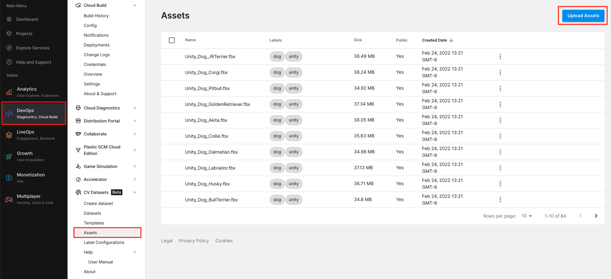
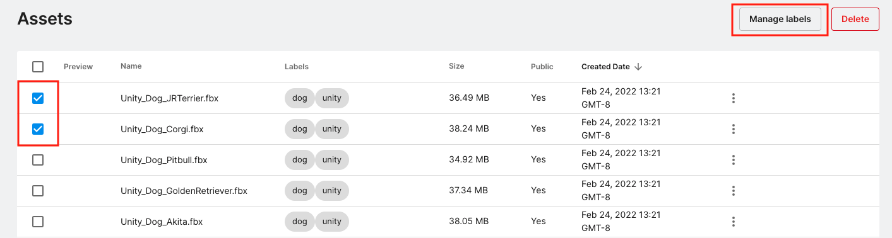
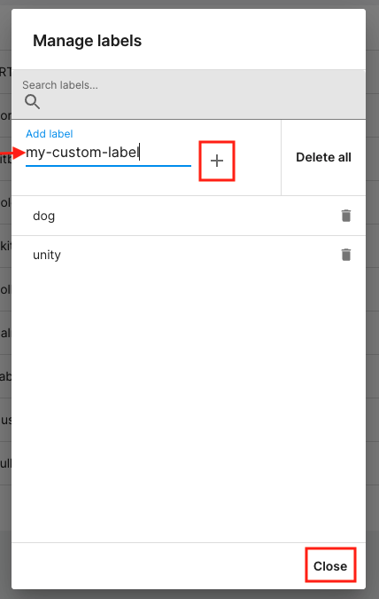

## Create your own assets on UCVD

You are able to create datasets for your own objects in the Unity Computer Vision Datasets (UCVD) service. This document introduces how to create your own 3D content and use it on UCVD.

### Create 3D Content

It can be challenging to create 3D content and bring it to Unity. Please follow [this tutorial](https://github.com/Unity-Technologies/SynthDet/blob/master/docs/CreatingAssets.md) for creating your own 3D content.

UCVD service only accepts FBX files as assets that contain meshes, materials, animations, and embedded textures. You can export or convert each of your 3D models into a single FBX file before uploading it to UCVD. Please always make sure that all necessary contents are packed in the file. If any content is missing, such as the embedded texture, the generated dataset won't meet your expectation.

### Set Up Assets on UCVD

1. Navigate to the [UCVD Dashboard](https://dashboard.unity3d.com/computer-vision-datasets) in your browser.

1. Click the **DevOps** in the left column and choose the **CV Datasets > Assets** in the second to the left column.

1. Click the **Upload Assets** button.

	

1. In the popup window, drag or add your asset files in the gray box.

	> Note: You can add multiple asset files in a batch.

	> Note: You can make the assets public so that all UCVD users will be able to see and use them. The public assets CAN NOT be converted to private after it is uploaded.

1. Click the **Upload** button

	<image src="images/ucvd-upload-assets.png" width="500">

1. The assets need to have labels so that the corresponding objects can be labeled in the generated datasets. In the table of your assets, select the assets that you want to edit the labels and click the **Manage labels** button.

	

1. In the popup window, type the name of your custom label and click the **"+"** button. The label will be added to the list below for all the selected assets.

1. Click the **Close** button. The new labels will be shown in the **labels** column of the assets table.

	

### Use the assets

You can now use your assets to generate your datasets and label these assets with your custom labels. For more details, take a look at the [data generation of our Indoor Dog Detection sample](dataset-generation-and-configuration.md).
