## Create a synthetic dataset for dog detection with UCVD

These workflow steps describes the process of using the Home Interior template and 3D dog modles to create a synthetic dataset of indoor dogs.

<p align="center">
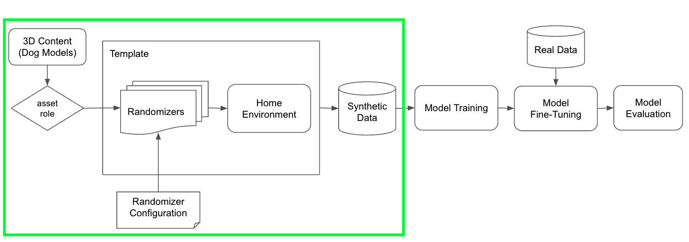
</p>

### Select a Template

> Note: Template is a Unity project pre-built to help bootstrap your dataset generation work. It provides the environments where the assets and objects are placed, such as home and retail shelves. In addition, the template contains structure and logic for the placement of assets and randomization of object and scene variables.

1. Navigate to the [UCVD Dashboard](https://dashboard.unity3d.com/computer-vision-datasets) in your browser, and the webpage shows as the image below.

1. Click the **DevOps** in the left column and choose the **CV Datasets > Create dataset** in the second to the left column.

	> Note: There are three templates that are publicly offered, and each template provides the environment in the generated images. In this example, we are going to choose the Home Interior template as our environment of data.

	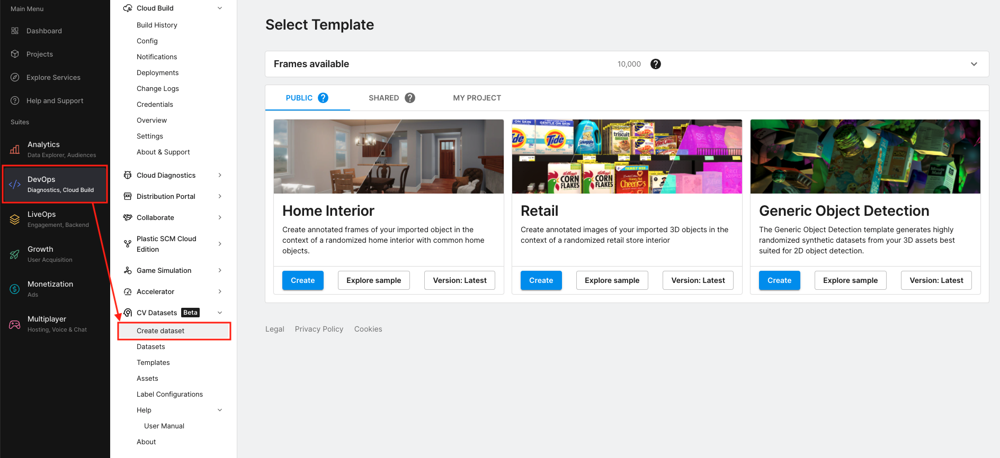

	> Note: Users could generate as many as 10,000 free images for each [Unity organization](https://id.unity.com/organizations). The available frames are displayed in the **Frame available** section above the templates. If you need to generate more data, please contact <datamaker-support@unity3d.com>.

	> 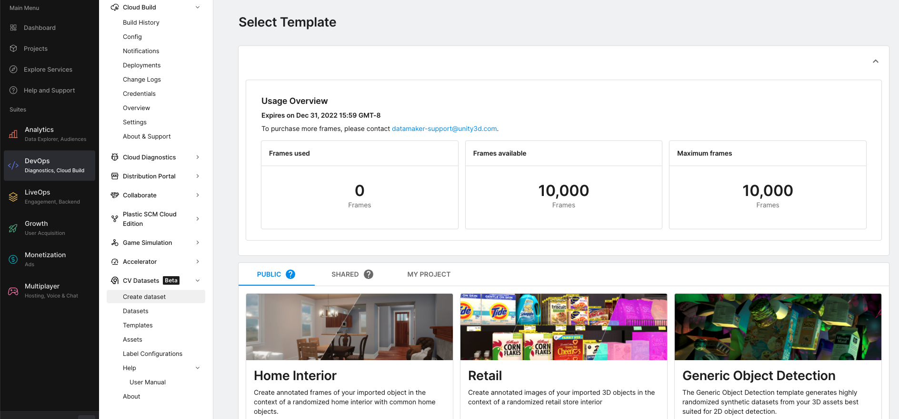

1. Click the **Version: Latest** button and confirm that you are using version **3.0.0**.

	> Note: All the UCVD templates are versioned. Version 3.0.0 of the Home Interior template is capable to randomize the assets by their embedded animations.

	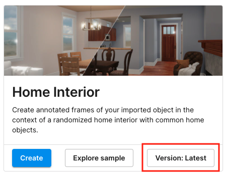 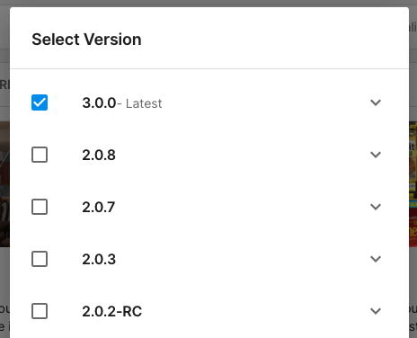

1. Click **Create** button of the Home Interior template

### Select Assets

> Note: Assets are 3D models of the objects of interest that you want rendered as part of the dataset. These would be the objects that your computer vision models would be trained to detect. At this time, UCVD only support FBX files with embedded textures and animations.

> Note: The Home Interior template provides empty homes with furniture, but there are no people or pets in it, so we need to add pets into the selected environment. In this example, we are going to only place dogs into the houses. If you need to place your own pets, such as cats or other small mammals, the UCVD accepts custom FBX assets and you could upload them. To create your own assets, please follow [this instruction](create-ucvd-assets.md).

1. In the webpage as shown below, type `unity_dog` in the search bar to filter assets by their names.

	> Note: We offered 11 breeds of dogs: _Doberman_, _Husky_, _Labrador_, _Bull Terrier_, _Dalmatian_, _Pitbull_, _Collie_, _Corgi_, _JR Terrier_, _Akita_, and _Golden Retriever_. You could select all breeds by marking the checkbox in the header of the asset table.

	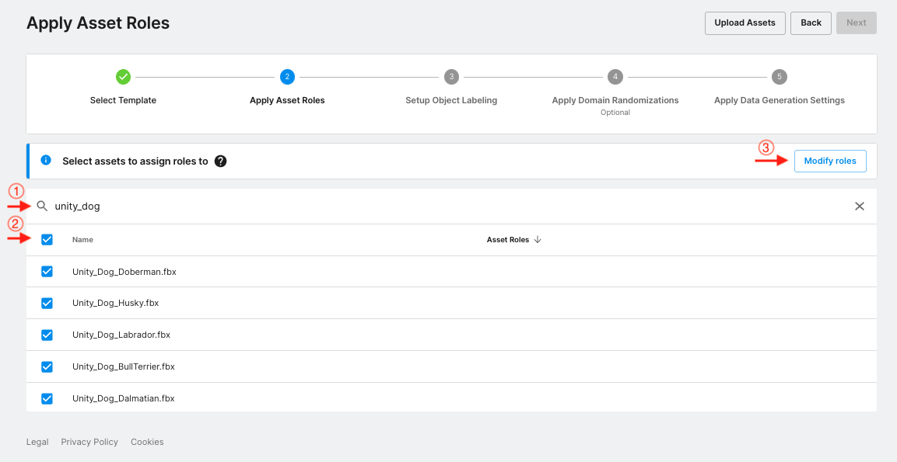

1. Click the **Modify roles** button and you will see a popup window as the following image.

	> Note: This window is to assign asset roles to the selected assets. The asset roles are defined by the template, which is used to link the assets and randomizers that will be configured in the later steps. The Home Interior template only has a single asset role: "foreground".

1. Click the **foreground** box in the popup window and it will be moved to the **Added** box.

1. Click the **Close** button to close the floating window.

	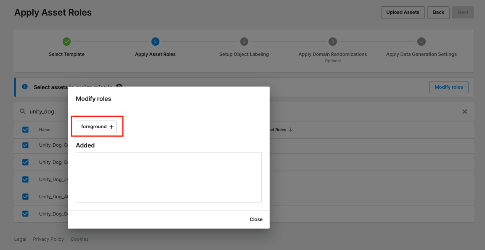

1. After closing the popup window, you will see the roles are assigned in right column of the asset table, as shown in the image below. Click the **Next** button on the top-right corner of the dashboard.

	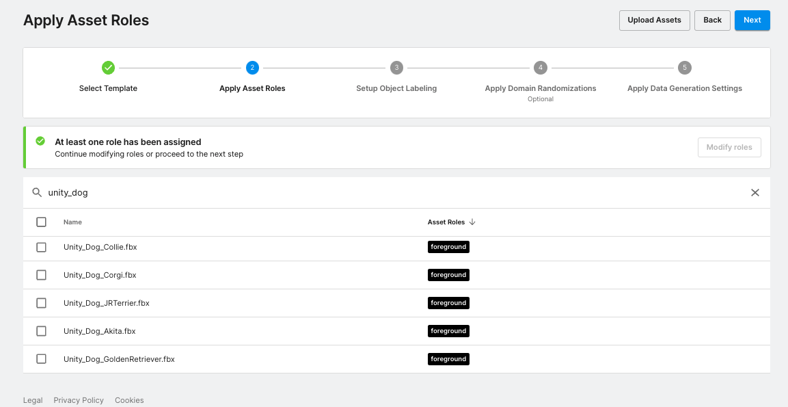

### Object Labeling

1. Click the dropdown box. In the three labeling modes, choose **"Custom Configuration"**.

	> Note: This step is to set up object labeling so that the generated dataset contains labels for each object, like furniture and dog. The Home Interior template contains a set of default labels for the furniture, such as _Table\_Dining_ and _Bookcase_, but it does not contain the label for dog assets.

	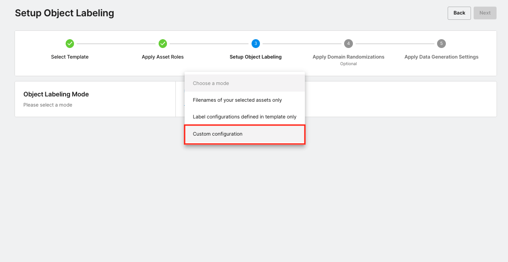

1. In the popup window, click "No".

	> Note: This will not add any default furniture label to the labelers. We are going to set up the label for dogs only.

	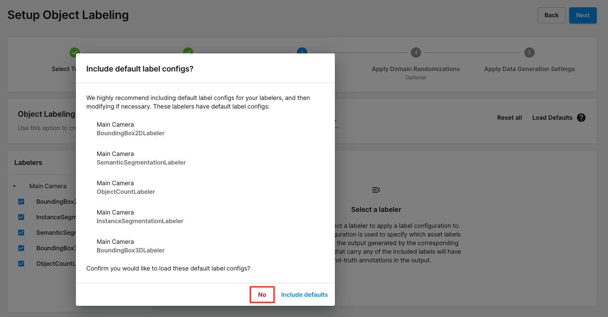

1. In the webpage as the following image, choose **BoundingBox2DLabeler**, mark the checkbox of the **dog** label, and click the **Apply** button. You will see the **dog** label moved to the right column.

	> Note: You can create custom labels for your own assets. Please follow [this instruction](create-ucvd-assets.md) to create your own labels.

	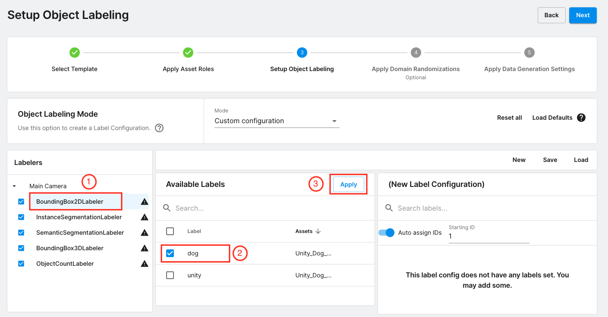

1. **Repeat** the above step on all the other labelers: _InstanceSegmentationLabeler_, _SemanticSegmentationLabeler_, _BoundingBox3DLabeler_, and _ObjectCountLabeler_.

	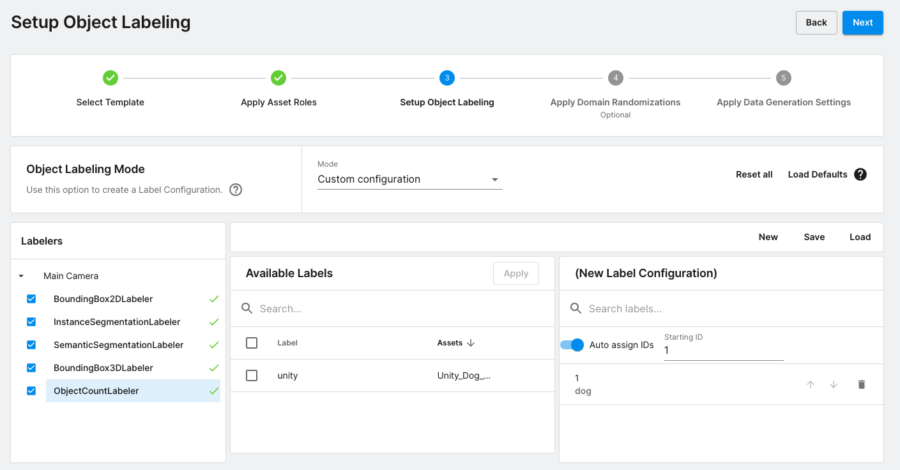

1. Click the **Next** button, and then click **Save & Next** button in the popup window to continue.

### Randomizers

> Note: A set of randomizers are used to introduce variety into the generated dataset. The Home Interior template provides five randomizers to randomize different factors in the data. You could unfold each randomizer and view the descriptions. In this example, we will only update the parameters in the **Foreground Object Placer** and keep all the other randomizers with default configurations. In the process of data generation, the foreground object placer will find all assets with the "foreground" role and randomly place them in the home.

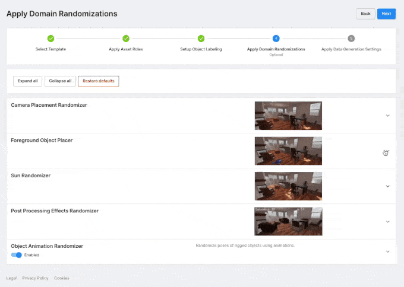

1. Expand the **Foreground Object Placer > Scalar**, and configure the randomizer using the following values.

	| Parameter | Value |
	| --------- | ----- |
	| Use Physics to Place Objects | false |
	| Freeze Rotation around X-Axis | true |
	| Freeze Rotation around Y-Axis | false |
	| Freeze Rotation around Z-Axis | true |
	| Randomize Rotation | true |
	| Minimum Distance of Placed Objects to the Camera | 0.1 |
	| Normalize Object Sizes | false |
	| Confinement of Placing Objects in the Camera View | 1.0 |
	| Normalized Object Size | 0.5 |
	| Uniform Sampling | Min: 1, Max: 10 |

1. Make sure the **Object Animation Randomizer** is enabled

	> Note: The dog assets contain animations of dog poses, such as walking and sitting. The object animation randomizer here is to introduce a variety of dog poses in the generated datasets.

	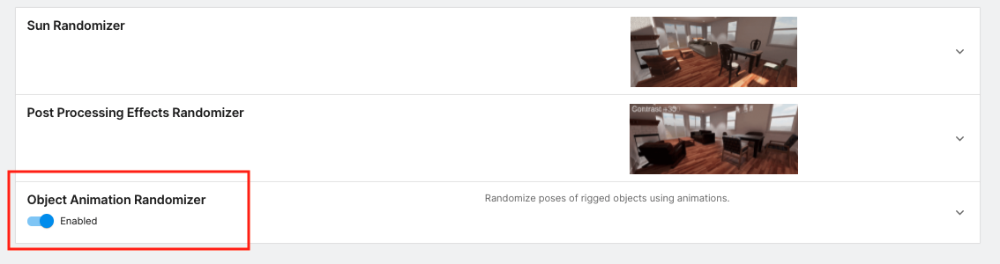

1. Click the **Next** button.

### Data Generation Settings

1. Expand the **Settings** box, and set the parameters using the following values

	| Parameter | Value |
	| --------- | ----- |
	| Frames | 10000 |
	| Run Name | Indoor-Pet-Detection |
	| Output Format | Coco |

	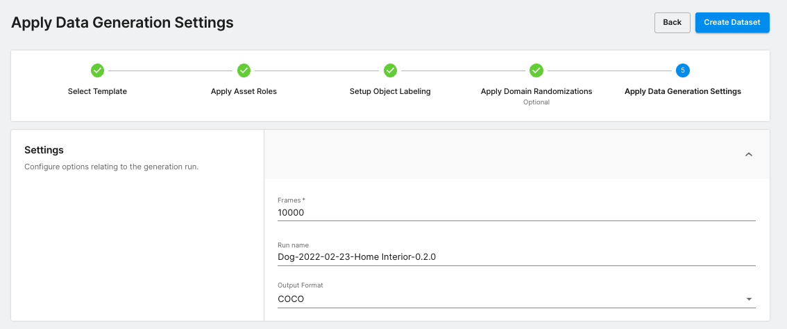

1. Click the **Create** button and then click the **continue** in the popup window

	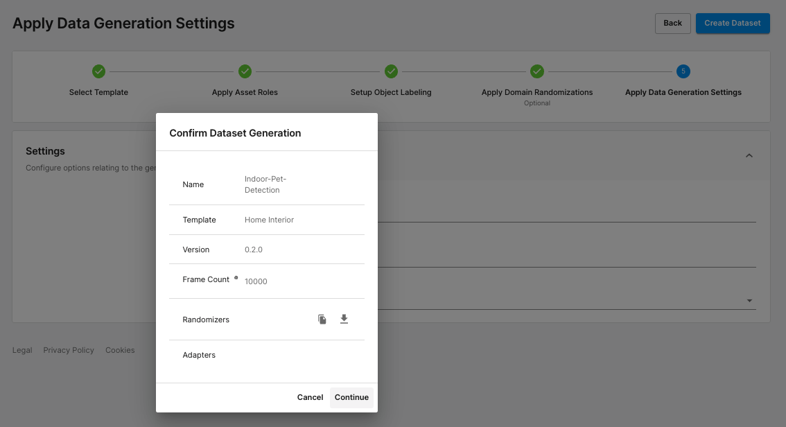

> Note: The data generation will be triggered after this step. You can check the status of the generation in **DevOps > CV Datasets > Datasets**. The whole process may take about one hour to complete.

> 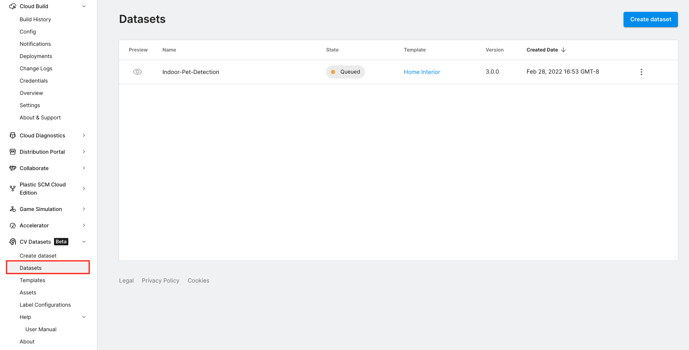

### Preview Dataset

1. Once data generation is completed, go to **DevOps > CV Datasets > Datasets** and click the **Preview** icon on the left of the run.

	

	> Note: You can also open the preview page by clicking the vertical ellipsis ("⋮") on the right of the run and selecting the **Preview dataset**

	> 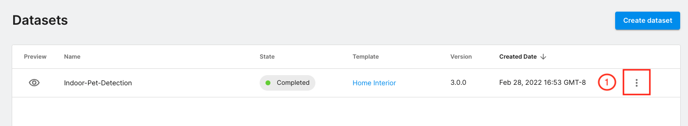
	> 

1. In the **Preview Dataset** page, left-click any image to switch it to the **Zoom View** as shown in the right image below

	> Note: the **Bounding Boxes** is the default annotation type in the zoom view, where all dogs will be annotated with a bounding box in the zoomed image

	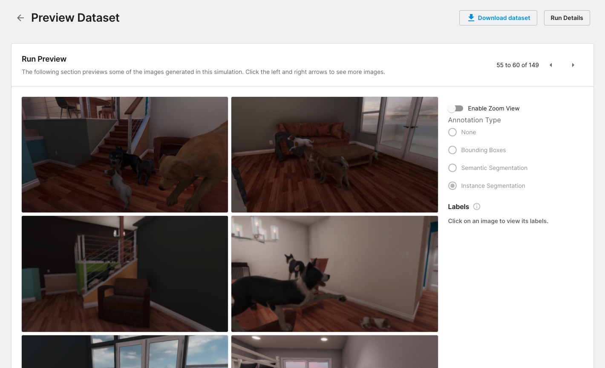 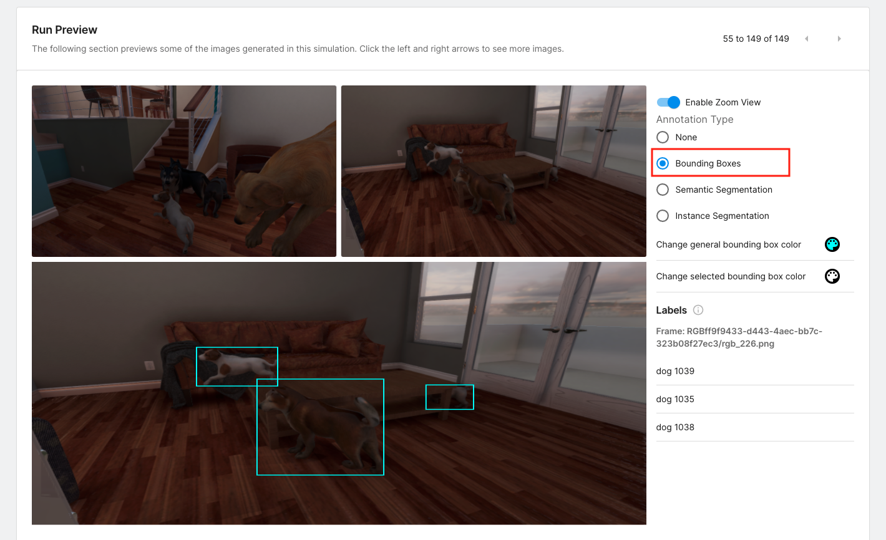

1. Select the **Semantic Segmentation** or **Instance Segmentation** to switch the annotation type in the image.

	> Note: We only added the **"dog"** label in the [object labeling step](#object-labeling), so dogs will be annotated in the **Semantic Segmentation** view but the furniture will not be.

	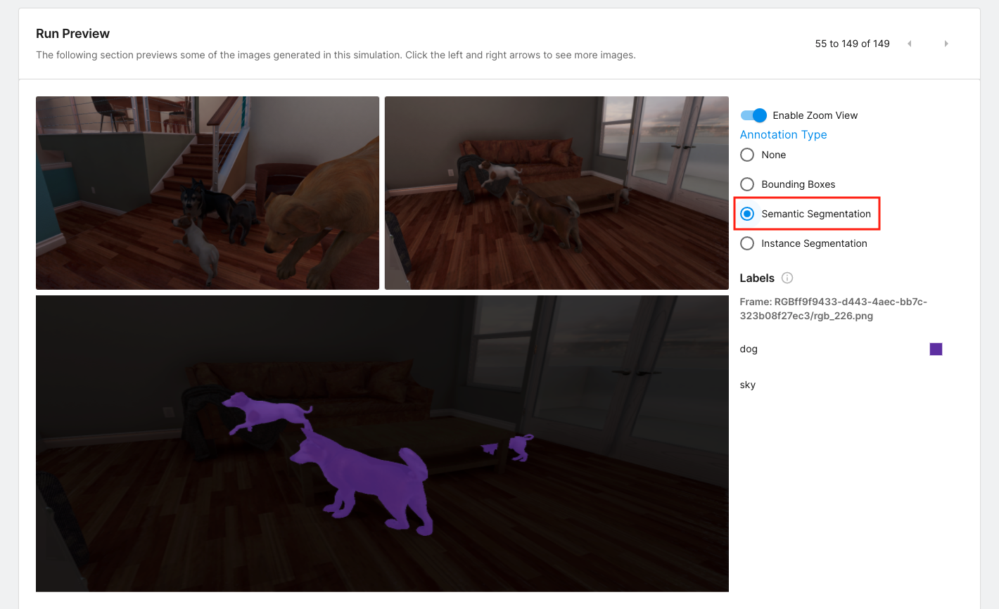 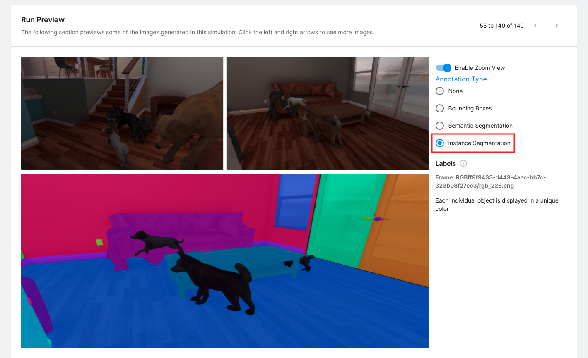

### Download Dataset

1. Go to **DevOps > CV Datasets > Datasets** and click the vertical ellipsis ("⋮") on the right of the run. Select **Download dataset**.

	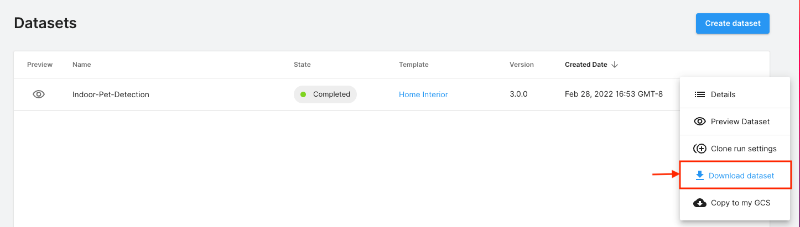

1. Run `tar -xf <your-tarball-file>` to extract the content to the local disk

	> Note: the extracted content contains two folders: _annotations_ and _images_. The tree structure is shown below

```
dataset
└─── annotations
|		 └─── coco.json
└─── images
	 └─── 1_rgb_6.png
	 └─── 1_rgb_10.png
	 		...
```

---

### Proceed to [Training and Evaluation](training-and-evaluation.md)
