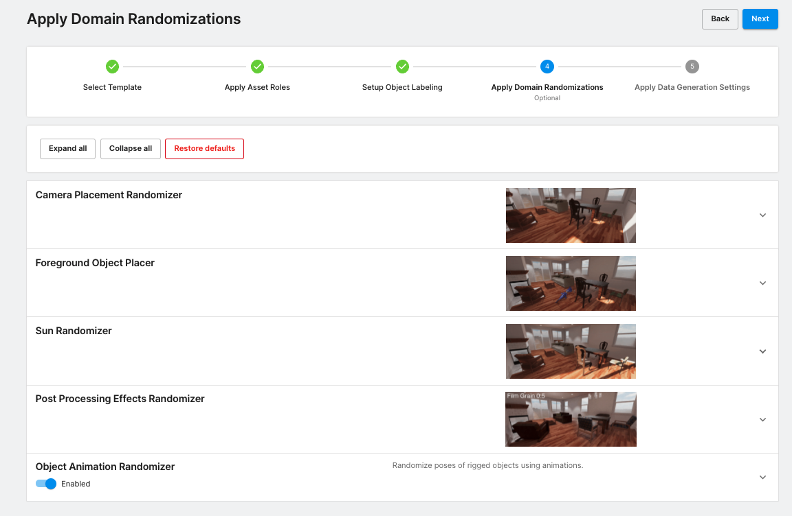

### Dataset Generation

#### Unity Dashboard

Open your browser and go to [Unity Dashboard](https://dashboard.unity3d.com/). Follow [the instruction](ucvd.md) to navigate to the UCVD dashboard.

#### Template

Use the **Home Interior** template that provides the home environments for your data generation. Please note the **"Frame available"** on top of the templates. It indicates the maximum number of images that the user could generate. Click the **"Create"** button to choose the Home Interior template and start the process to configure the data generation.

#### Custom Assets and Asset Roles

Assets are a collection of FBX files that have already been uploaded to UCVD. In the search box, please type in "unity_dog" to filter all the assets by their names. Click the checkbox in the header row to select all the unity dog assets.

Then click the "Modify roles" button to add asset roles to the chosen assets. The asset roles are defined by the template, which is used to place the assets in the given environment. The Home Interior template only has one role ("foreground"), so click the "foreground" in the popup window and it will be added to the "Added" box. Click the "Close" button to return to the UCVD webpage.

The asset roles will be displayed in the asset table. Then click the "Next" button.

#### Object Labeling

In the Object Labeling Mode, click on the dropdown menu and choose "Custom configuration" mode. Click "include defaults" in the popup window to add all default labels for the furniture (e.g. tables, sofa, etc.) in the home environment. You could choose "no" if you don't need the furniture to be labeled.

The home interior provides five templates shown in the "Labeler" box. All the labelers only contain the default labels (e.g. Tabel\_Dining, Chair\_Dining, etc.) if you have chosen to include defaults, but there are no labels for the dog assets we just added in the asset step. Therefore, for each of the labelers, select the "dog" label in the "Available Labels" box and click the "Apply" button to add the dog label to the labeler.

Click the "Next" button and click the "Save & Next" in the popup window.

#### Randomizers

Home Interior template provides five domain randomization mechanisms. Click the Foreground Object Placer and set the parameters to the following values.

<table>
<tr>
  <td>Parameter</td>
  <td>Value</td>
</tr>
<tr><td>Use Physics to Place Objects</td><td>false</td>
<tr><td>Freeze Rotation around X-Axis</td><td>true</td>
<tr><td>Freeze Rotation around Y-Axis</td><td>false</td>
<tr><td>Freeze Rotation around Z-Axis</td><td>true</td>
<tr><td>Randomize Rotation</td><td>true</td>
<tr><td>Minimum Distance of Placed Objects to the Camera</td><td>0.1</td>
<tr><td>Normalize Object Sizes</td><td>false</td>
<tr><td>Confinement of Placing Objects in the Camera View</td><td>1.0</td>
<tr><td>Normalized Object Size</td><td>0.5</td>
<tr><td>Uniform Sampling</td><td>Min: 1, Max: 10</td>
</table>

Click "Next" button.

#### Data Generation Settings

Click the edit button to expand the "Settings" box, use the following parameters to generate the dog dataset.

<table>
<tr>
  <td>Parameter</td>
  <td>Value</td>
</tr>
<tr><td>Frames</td><td>10000</td>
<tr><td>Run Name</td><td>Unity-Dog-Home-Interior</td>
<tr><td>Output Format</td><td>Coco</td>
</table>

Left-Click "Create" button and click "continue" in the popup window.
