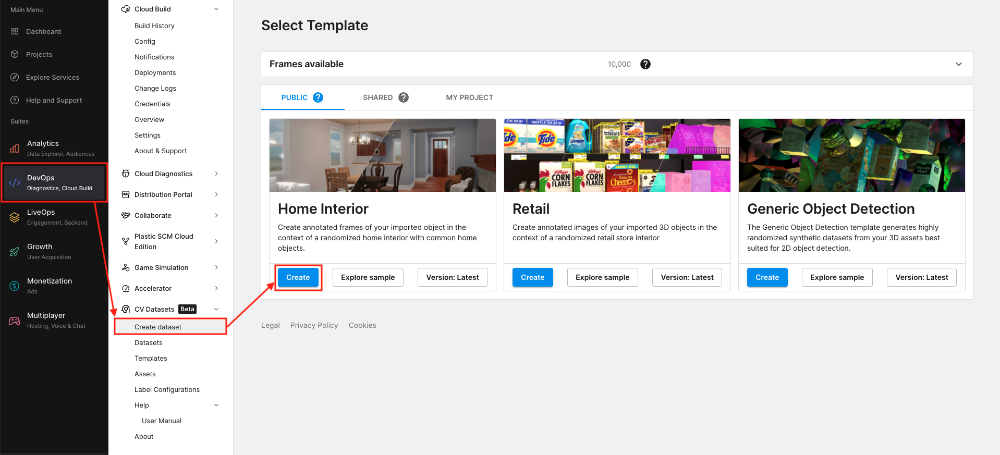
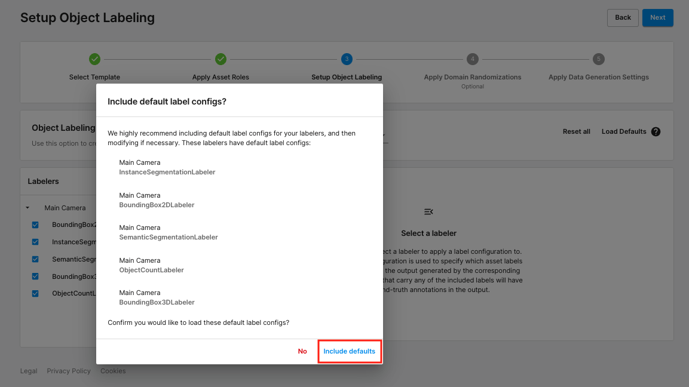
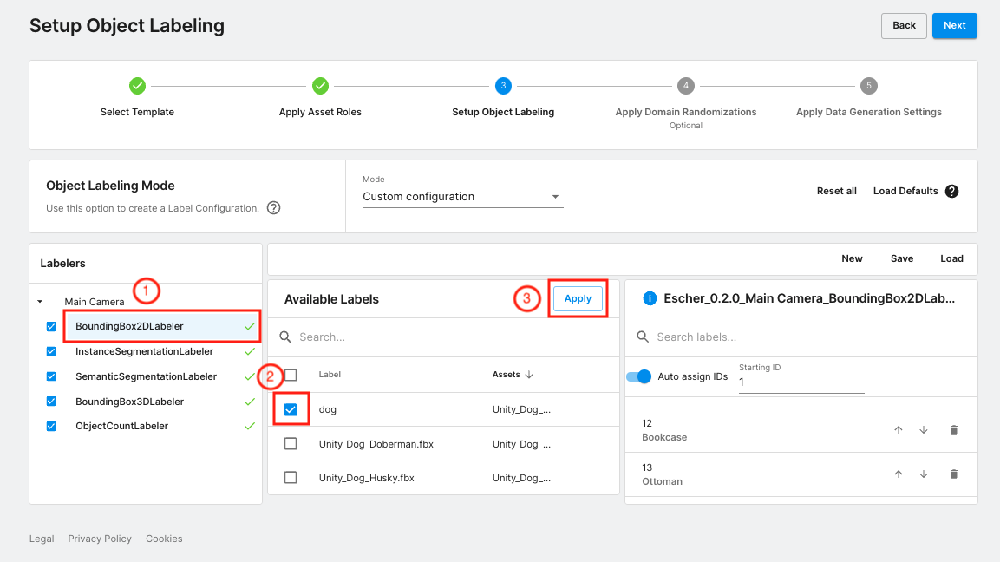

# Dataset Generation

**Table of Contents**

  - [Requirements](#requirements)
  - [Generate Synthetic Data](#generate-synthetic-data)
    - [Select a Template](#select-a-template)
    - [Select Assets](#select-assets)
    - [Object Labeling](#object-labeling)
    - [Randomizers](#randomizers)
    - [Data Generation Settings](#data-generation-settings)
  - [Proceed to Setup Training Environment](#proceed-to-training)

---

## Requirements

Unity Computer Vision Datasets (UCVD) service provides data generation at scale on Cloud. To use UCVD, you are asked to have a Unity project associated with a Unity ID and organization. If you haven't had a Unity project, please follow [the instructions](ucvd.md) to create a Unity account and set up a Unity project via the [Unity Dashboard](https://dashboard.unity3d.com/).

---

## Generate Synthetic Data

### Select a Template

1. Navigate to the [UCVD Dashboard](https://dashboard.unity3d.com/computer-vision-datasets) in your browser, and the webpage shows as the image below.

1. Click the **DevOps** in the left column and choose the **CV Datasets > Create dataset** in the second to the left column.

	> Note: There are three templates that are publicly offered, and each template provides the environment in the generated images. In this example, we are going to choose the Home Interior template as our environment of data.

1. Click the **Version: Latest** button and confirm that you are using version **2.0.9**.

	> Note: All the UCVD templates are versioned.

	> Note: Users could generate as many as 10,000 free images for each [Unity organization](https://id.unity.com/organizations). The available frames are displayed in the **Frame available** section above the templates. If you need to generate more data, please contact <datamaker-support@unity3d.com>.

1. Click **Create** button of the Home Interior template

	

### Select Assets

> Note: The Home Interior template provides empty homes with furniture, but there are no people or pets in it, so we need to add pets into the selected environment. In this example, we are going to only place dogs into the houses. If you need to place your own pets, such as cats or other small mammals, the UCVD accepts custom FBX assets and you could upload them.

1. In the webpage as shown below, type `unity_dog` in the search bar to filter assets by their names.

	> Note: We offered 11 breeds of dogs: _Doberman_, _Husky_, _Labrador_, _Bull Terrier_, _Dalmatian_, _Pitbull_, _Collie_, _Corgi_, _JR Terrier_, _Akita_, and _Golden Retriever_. You could select all breeds by marking the checkbox in the header of the asset table.

	

1. Click the **Modify roles** button and you will see a popup window as the following image.

	> Note: This window is to assign asset roles to the selected assets. The asset roles are defined by the template, which is used to link the assets and randomizers that will be configured in the later steps. The Home Interior template only has a single asset role: "foreground".

1. Click the **foreground** box in the popup window and it will be moved to the **Added** box.

1. Click the **Close** button to close the floating window.

	

1. After closing the popup window, you will see the roles are assigned in right column of the asset table, as shown in the image below. Click the **Next** button on the top-right corner of the dashboard.

	

### Object Labeling

1. Click the dropdown box. In the three labeling modes, choose **"Custom Configuration"**.

	> Note: This step is to set up object labeling so that the generated dataset contains labels for each object, like furniture and dog. The Home Interior template contains a set of default labels for the furniture, such as _Table\_Dining_ and _Bookcase_, but it does not have the label for the dog assets, so we need to customize the labels.

	

1. In the popup window, click "Include defaults".

	> Note: This will add all the default furniture labels to all the labelers.

	

1. In the webpage as the following image, choose **BoundingBox2DLabeler**, mark the checkbox of the **dog** label, and click the **Apply** button. You will see the **dog** label moved to the right column.

1. Repeat the above step on all the other labelers: _InstanceSegmentationLabeler_, _SemanticSegmentationLabeler_, _BoundingBox3DLabeler_, and _ObjectCountLabeler_.

	

1. Click the **Next** button, and then click **Save & Next** button in the popup window to continue.

### Randomizers

> Note: The Home Interior template provides five randomizers to randomize different factors in the data. You could unfold each randomizer and view the descriptions. In this example, we will only update the parameters in the **Foreground Object Placer** and keep all the other randomizers with default configurations. In data generation, the foreground object placer will find all assets with the "foreground" role and randomly place them in the home.

1. Expand the **Foreground Object Placer > Scalar**, and configure the randomizer using the following values.

	| Parameter | Value |
	| --------- | ----- |
	| Use Physics to Place Objects | false |
	| Freeze Rotation around X-Axis | true |
	| Freeze Rotation around Y-Axis | false |
	| Freeze Rotation around Z-Axis | true |
	| Randomize Rotation | true |
	| Minimum Distance of Placed Objects to the Camera | 0.1 |
	| Normalize Object Sizes | false |
	| Confinement of Placing Objects in the Camera View | 1.0 |
	| Normalized Object Size | 0.5 |
	| Uniform Sampling | Min: 1, Max: 10 |

1. Make sure the **Object Animation Randomizer** is enabled

	

1. Click the **Next** button.

### Data Generation Settings

1. Expand the **Settings** box, and set the parameters using the following values

	| Parameter | Value |
	| --------- | ----- |
	| Frames | 10000 |
	| Run Name | Indoor-Pet-Detection |
	| Output Format | Coco |

	

1. Click the **Create** button and then click the **continue** in the popup window

	

---

## Proceed to [Setup Training Environment](setup-training-environment.md)
