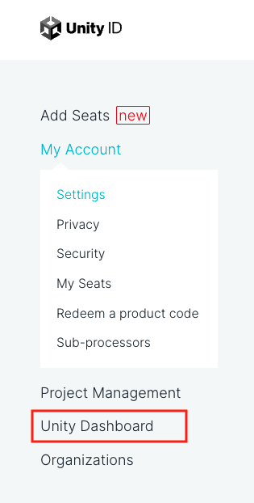
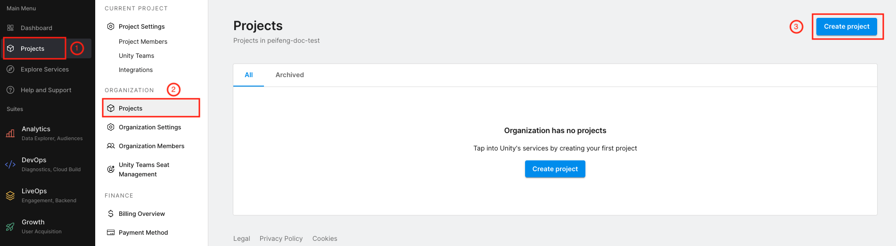

## Prerequisites

**Table of Contents**

  - [Setup Unity Account](#setup-unity-account)
  - [Setup Training Environment](#setup-training-environment)
  - [Setup UCVD Auth](#setup-ucvd-auth)
  - [Proceed to Data Generation](#proceed-to-data-generation)

---

### Setup Unity Account

Unity Computer Vision Datasets (UCVD) service provides data generation at scale on Cloud. To use UCVD, you are asked to have a Unity Service Project associated with a Unity Service Account. You can skip this step if you have already had a Unity Service Project.

#### Create a Unity Account

> Note: You can skip this step if you have already had a Unity account.

1. Go to [create a new Unity ID](https://id.unity.com/account/new)

1. Fill and submit the form to create your Unity ID

	> Note: Pleasse make sure to read and accept Unity's Terms of Use and Privacy Policy before proceeding. More details of instructions can be found on the [Unity support website](https://support.unity.com/hc/en-us/articles/208626336-How-do-I-create-a-Unity-ID-account-)

#### Create a New Organization

> Note: you can skip this step if you want to use an existing organization to generate the datasets on UCVD.

> Note: More detailed instructions can be found on the [Unity support website](https://support.unity.com/hc/en-us/articles/208592876-How-do-I-create-a-new-Organization-)

1. Sign in to your Unity Account at [id.unity.com](https://id.unity.com)

1. Click the **Organizations** on the left column of the webpage

1. Click the **Add new** button

1. Enter the name of your new organization and click the **Create** button.

#### Create a New Project

> Note: you can skip this step if you are using an existing project to generate the datasets on UCVD

1. Sign in to your Unity Account at [id.unity.com](https://id.unity.com)

1. Click the **Unity Dashboard** in the left of the column

	

1. Click the **Project** on the left column of the dashboard, and then click the **Create** button.

	

1. Enter the name of your new project and click the **Create project** button

---

### Setup Training Environment

This step is to set up the Python environment and datasets for the model training. With this environment, we will train the Fast R-CNN model using the synthetically generated data from UCVD and reproduce the [results](results.md) shown in the sample.

#### Installation

* conda (Please follow this [Link](https://docs.conda.io/projects/conda/en/latest/user-guide/install/index.html) for installing conda)
* cuda drivers (If GPU available)

#### Setup Conda

1. `conda env create --file environment.yml -n unity-cv-dog-detection python=3.8`
2. `conda activate unity-cv-dog-detection`
3. `conda env update -n unity-cv-dog-detection --file environment.yml`

N.B. - We use 8 Nvidia V100 GPUs for our experiments.

#### Datasets

We trained with multiple strategies using real & synthetic data. The following explains the datasets we used:

##### Real data

We used real data for fine-tuning & testing the final models for performance.
[COCO](https://cocodataset.org/#home) and [OIDSv6](https://storage.googleapis.com/openimages/web/index.html) was
filtered with classes including `dog` and indoor artifacts like `microwave`, `couch` etc.

This resulted in a total of 1538 images, and we split it -

| Task        | No. of images (real) |
|-------------|----------------------|
| fine-tuning | 1200                 |
| validation  | 138                  |
| test        | 200                  |


TODO: Update links to datasets (@souranil)

Download the datasets from [here](https://github.com/Unity-Technologies/Indoor-Pet-Detection/releases/download/v0.1.1/real_datasets.zip)


##### Synthetic

We use the "Home Interior" template and the "dog assets" to generate different amounts of synthetic data while keeping the data distribution similar to the real data.

The no. of frames we experimented with are:

- 5k
- 10k
- 40k
- 100k


#### Directory Structure

Make sure you download the datasets to the following folder structure:

```
project
└───data
│   └───synth
│   │     └───train-10k
│   │         └───annotations
│   │         │      coco.json <-- (synthetic train)
│   │         └───images
│   └───real
│         └───test2017
│         │   └───annotations
│         |   │     coco.json
│         |   └───images
│         └───train2017
│         |   └───annotations
│         |   │     coco.json
│         |   └───images
│         └───val2017
│             └───annotations
│             │     coco.json
│             └───images
```

---

### Setup UCVD Auth
   1. Follow [UCVD Guide](http://doesnot-exist-yet.com) to get the API Token. You will be using this for UCVD APIs.
   2. Generate a dataset on UCVD # TODO: switch over to SDK later
   3. Get the runID, and set it to the environment variable `UNITY_CVD_RUN_ID`.
   4. Make sure you have the real world data from [here]() in `data/real/`.

---

### Proceed to [Data Generation](dataset-generation-and-configuration.md)
